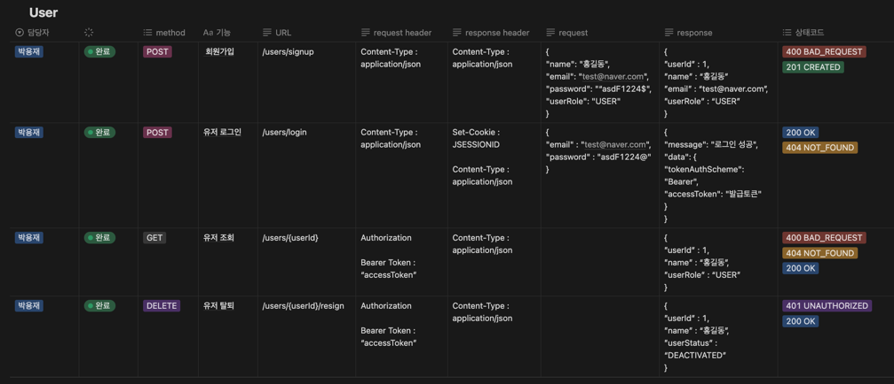
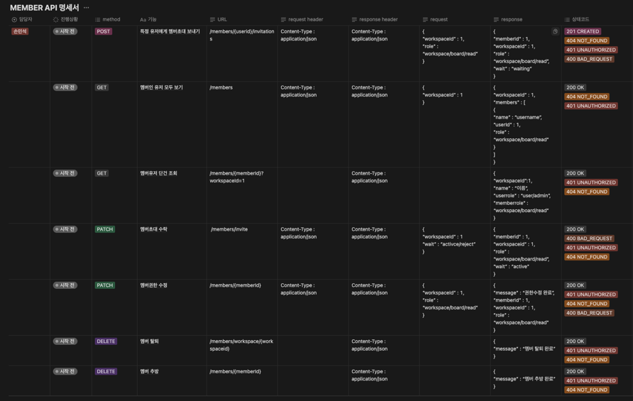
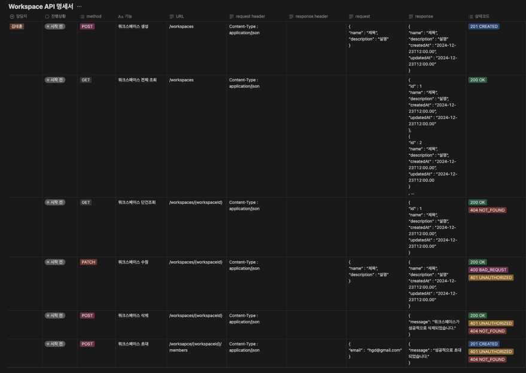
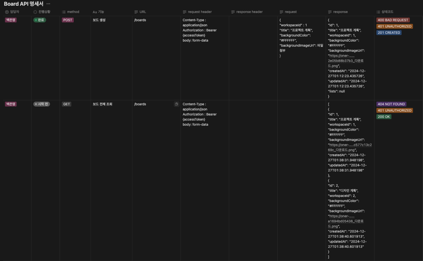
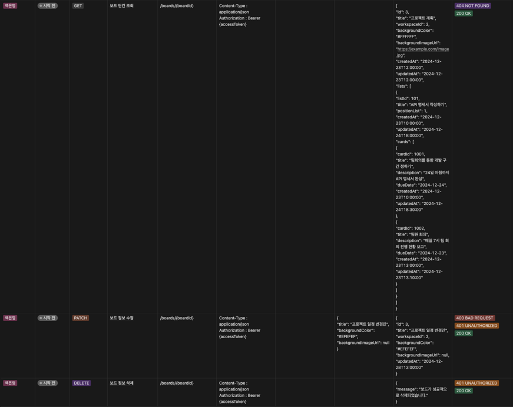
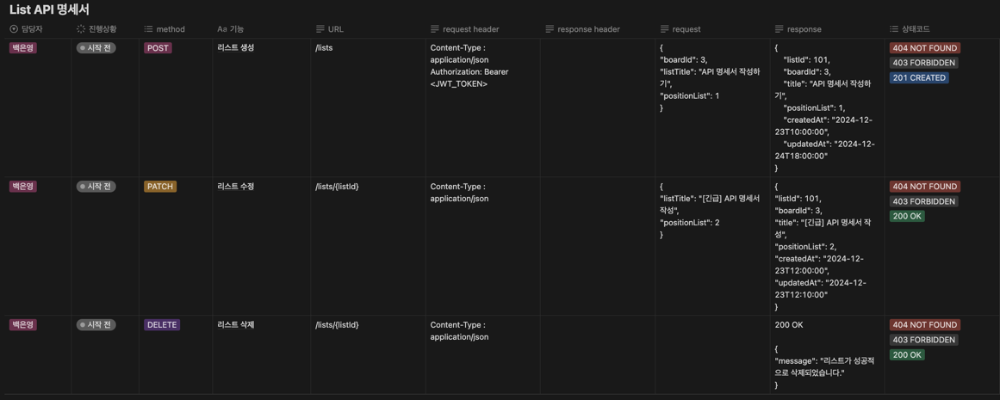
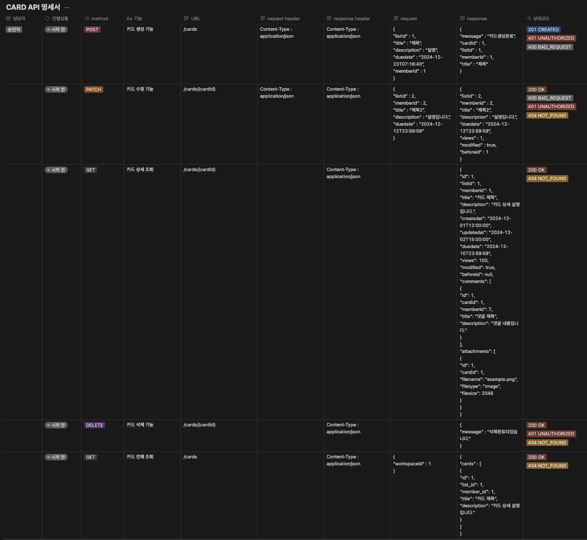
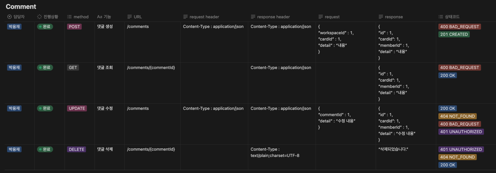
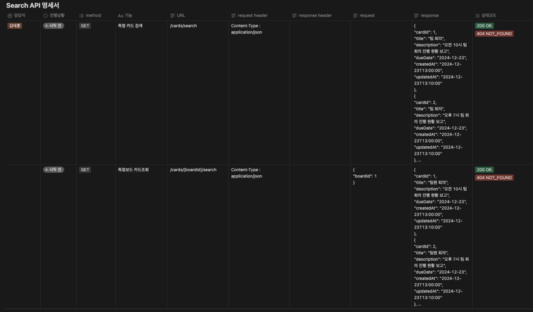
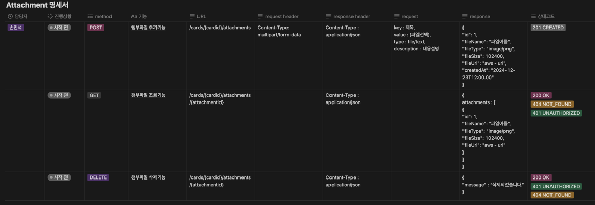

# 프로젝트명 : O!wner

## 📖 목차
1. [프로젝트 소개](#프로젝트-소개)
2. [팀소개](#팀소개)
3. [프로젝트 계기](#프로젝트-계기)
4. [주요기능](#주요기능)
5. [개발기간](#개발기간)
6. [기술스택](#기술스택)
7. [서비스 구조](#서비스-구조)
8. [와이어프레임](#와이어프레임)
9. [API 명세서](#API-명세서)
10. [ERD](#ERD)
11. [프로젝트 파일 구조](#프로젝트-파일-구조)
12. [Trouble Shooting](#trouble-shooting)
    
## 👨‍🏫 프로젝트 소개
- *한 줄 정리* : Owner라면 반드시 알아야 할 애플리케이션📲

- *프로젝트 내용* : Owner는 프로젝트의 주인(owner)으로서 모든 과정을 주도적으로 관리할 수 있는 협업 플랫폼입니다.
  ToDoList를 통해 작업 현황을 한눈에 파악하고, 참여 인원 간의 활발한 소통과 효과적인 일정 관리가 가능합니다.

## 팀소개

## 프로젝트 계기
팀원 간의 소통과 일정 관리를 보다 원활하게 하고, 프로젝트의 주인(owner)으로서 관리할 수 있는 협업 플랫폼을 만들고자 시작 되었습니다.

## 💜 주요기능

- *기능 1* : 회원가입 및 로그인
    - 회원가입 : Email, PASSWORD, USER/ADMIN 권한 선택
    - 로그인 : Email과 PASSWORD를 통하여 로그인
    - 회원탈퇴 : 유저의 토큰을 확인하여 탈퇴 처리

- *기능 2* : 멤버 및 역할 관리
    - 유저 권한 : USER(일반), ADMIN(관리자)
    - 멤버 역할 : 워크스페이스 관리자, 보드, 읽기 전용으로 구분

- *기능 3* : 워크스페이스
    - 생성 : 유저 권한이 ADMIN(관리자)인 경우에만 생성 가능
    - 멤버 초대 : 이메일로 초대 가능
    - 조회 : 유저가 멤버로 가입된 워크스페이스 목록 조회 가능
    - 수정 : 멤버 역할에 따라 가능(ex. 워크스페이스 역할을 가진 멤버만 가능)
    - 삭제 : 삭제 시 모든 데이터 삭제

- *기능 4* : 보드
    - 생성/수정 : 워크스페이스 내에서 가능, 배경색/이미지 설정 가능
    - 조회 : 워크스페이스 내 보드와 관련 데이터 확인 가능
    - 삭제 : 리스트와 카드 포함 전체 삭제 가능

- *기능 5* : 리스트
    - 생성/수정 : 보드 내 리스트 생성 및 순서 변경 가능
    - 삭제 : 관련 카드 데이터도 함께 삭제 가능

- *기능 6* : 카드
    - 생성/수정 : 제목, 설명, 마감일, 담당자 추가 가능
    - 상세 조회 : 활동 내역과 댓글 포함
    - 삭제 : 카드와 관련된 데이터 삭제

- *기능 7* : 댓글
    - 작성 : 카드 내에서 댓글 작성 가능(텍스트, 이모지 포함)
    - 수정/삭제 : 자신의 댓글을 수정하거나 삭제 가능

- *기능 8* : 검색
    - 카드의 제목, 내용, 마감일, 담당자 이름을 기준으로 페이징 검색 가능
    - 특정 보드에 속한 모든 카드를 검색 가능

- *기능 9* : 첨부 파일
    - 추가 : 최대 5MB의 파일 첨부(이미지, 문서 등)
    - 조회/삭제 : 첨부된 파일을 조회 및 삭제 가능

- *기능 10* : 알림
    - 슬랙을 통한 실시간 알림으로 멤버 추가, 카드 변경 등 주요 이벤트 제공

## ⏲️ 개발기간
- 2024.12.23(월) ~ 2024.12.30(월)

## 📚️ 기술스택

### ✔️ Language
    - Java

### ✔️ Version Control
    - GitHub

### ✔️ IDE
    - IntelliJ IDEA

### ✔️ Framework
    - Spring Boot

### ✔️ Deploy
    - AWS (EC2, S3), Docker

### ✔️  DBMS
    - MySQL

## 서비스 구조
    - Spring Boot 기반의 RESTful API로 설계되었으며, 
    AWS EC2와 S3를 활용하여 배포 및 이미지 및 첨부파일을 관리 수행합니다.

## 와이어프레임

## [API 명세서](https://teamsparta.notion.site/1582dc3ef51481d99ba3c49760a2d77f)

 
**1. 회원가입/로그인**

 
**2. 멤버**

 
**3. 워크스페이스**

 
**4. 보드**

 
**5. 리스트**

 
**6. 카드**

 
**7. 댓글**

 
**8. 검색**

 
**9. 첨부파일**

## ERD

## Trouble Shooting
- [손민석 Trouble Shooting : S3버킷 액세스 권한 및 정책 ](https://usejava.tistory.com/35)
- [백은영 Trouble Shooting : 제목입력 ](링크 붙여넣기....)
- [박용재 Trouble Shooting : Slack Api ](https://velog.io/@skykid/Oner-Slack-Api-TrubleShooting)
- [김태훈 Trouble Shooting : 제목입력 ](링크 붙여넣기....)
